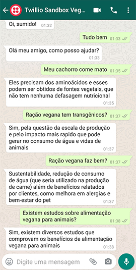

# Veg Pet Bot

  

                              ​                               

Após finalizar a inteligência artificial com o IBM Watson, houve integração com a [Twillio](https://www.twilio.com/) para o Whatsapp.

Clique **[AQUI](https://bit.ly/veg-pet-bot)** para **visualizar** o projeto.

## Projeto

A **Veg Pet Bot** é um projeto que tem como *finalidade* criar um robô de inteligência artificial para responder as perguntas frequentes da empresa [Veg Pet](https://www.vegpet.com.br/), realizado durante a semana bot pela empresa [Let's Bot](https://www.linkedin.com/company/letsbot/).

## Tecnologias

Esse projeto foi desenvolvido com as seguintes tecnologias:

- [IBM Watson Assistant](http://ibm.com/)
- [IBM Node Red](http://ibm.com/)
- [Twillio](http://twillio.com/)

Feito por **[Juan Junger](https://www.linkedin.com/in/juan-junger/)**.​

